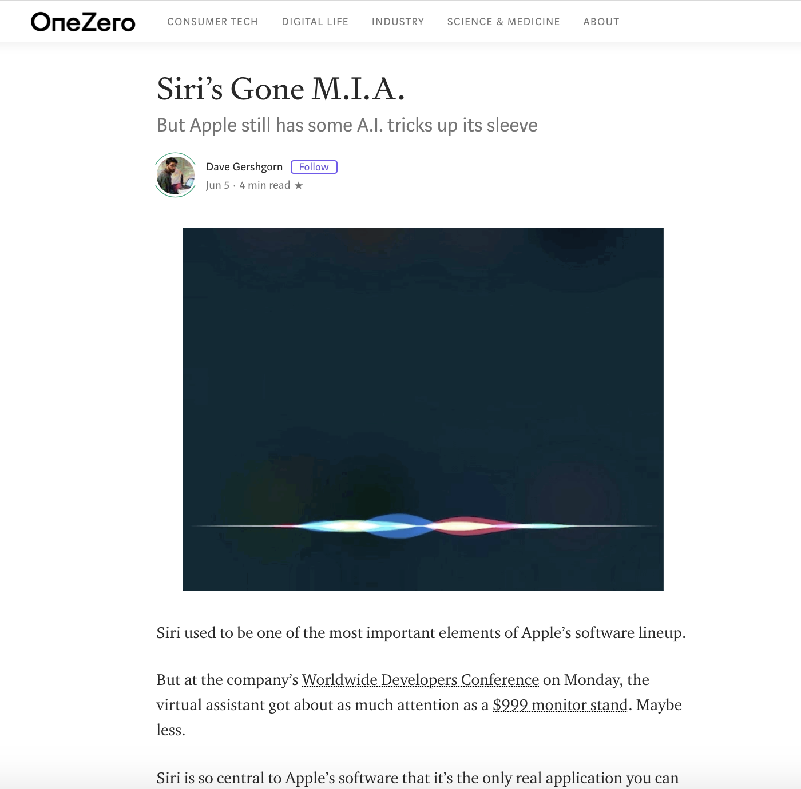
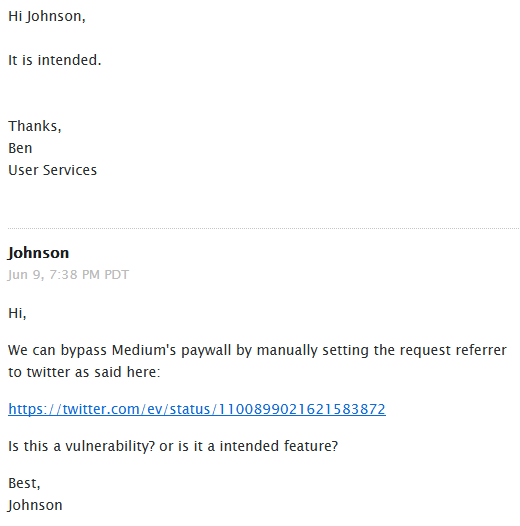

# Mediumship

[**DISCLAIMER: USE IT AT YOUR OWN RISK!**](#disclaimer)

📚 Mediumship is a browser extension that lets you try Medium with membership-features, allowing you to read all Medium stories for free.

## Installation

Google Chrome: [Download](https://github.com/swapagarwal/mediumship/archive/master.zip), [Instructions](https://www.mattcutts.com/blog/how-to-install-a-chrome-extension-from-github/)

Mozilla Firefox (works both on desktop & mobile browsers!): [Download](https://github.com/swapagarwal/mediumship/blob/master/firefox/web-ext-artifacts/addon-2.4.xpi?raw=true), [Instructions](https://extensionworkshop.com/documentation/publish/distribute-sideloading/#install-addon-from-file)

## Usage

This is an install-and-forget extension. It automatically unlocks Medium articles in the background, w/o requiring any user intervention.

P.S. If it doesn't work, sign out of Medium and refresh the page!

## Demo

## Screenshots

Before                | After
:--------------------:|:-------------------:
 | 

## Disclaimer

This is an extension that demonstrates the ability to modify HTTP request headers to twitter url. Use it at your own risk! The same result can be achieved by the following ways without the extension:

- Use another device
- Use your browser's incognito mode
- Paste a url on your twitter textbox, select it and right-click `go to link`

This extension modifies the HTTP request header referrer as mentioned [here](https://twitter.com/ev/status/1100899021621583872).

We've emailed to Medium's security department about this issue, and the reply says that the method is not a vulnerability.

